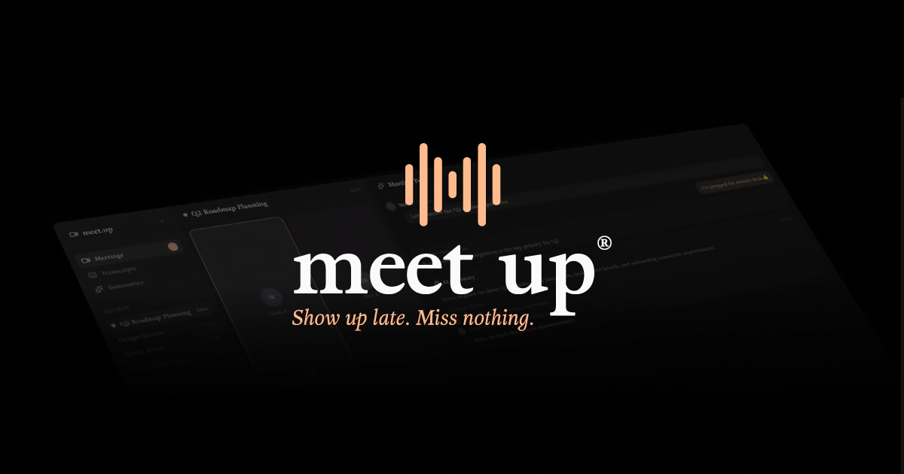
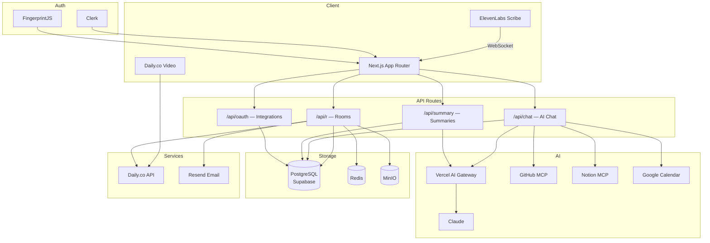

<h1 align="center">
  meet.up
  <br />
</h1>

<p align="center">
  One app for the entire meeting.
  <br />
  Video, transcription, and AI notes. No extra tools needed.
  <br />
  <br />
  <a href="https://meetup.crafter.run">Website</a>
  ·
  <a href="https://github.com/crafter-station/meet.up/issues">Issues</a>
</p>

<p align="center">
  <a href="https://nextjs.org">
    
  </a>
  <a href="https://daily.co">
    
  </a>
  <a href="https://clerk.com">
    
  </a>
  <a href="https://www.typescriptlang.org">
    
  </a>
  <a href="https://supabase.com">
    
  </a>
</p>

<p align="center">
  <a href="https://opensource.org/licenses/MIT">
    
  </a>
  <a href="https://github.com/crafter-station/meet.up/stargazers">
    
  </a>
</p>

<p align="center">
  <sub>
    Built by
    <a href="https://crafterstation.com">
      Crafter Station
    </a>
  </sub>
</p>

## About meet.up

meet.up is a video calling platform where transcription, AI notes, and summaries are built in. No need to stack Google Meet + Granola + Notion. One link, one app, everything captured.

## Features

**Live Transcription**: Every word, every speaker, captured in real time with automatic speaker attribution.<br/>
**AI Summaries**: Decisions, action items, and key takeaways generated automatically when your call ends.<br/>
**Meeting Feed**: A unified timeline for chat messages, notes, action items, and AI artifacts during the call.<br/>
**Zero Friction**: No downloads, no plugins. Share a link and start in seconds from any browser.<br/>
**GitHub Integration**: Create issues, look up repos, and reference code. All without leaving the call.<br/>
**Google Calendar**: Schedule meetings, view upcoming events, and sync your calendar in one click.<br/>
**Web Search**: Find answers and references mid-conversation without switching tabs.<br/>
**AI Chat Assistant**: Ask questions, get summaries, and interact with your meeting context in real time.<br/>

## Tech Stack

### Core

- [Next.js 16](https://nextjs.org) + React 19
- [TypeScript](https://www.typescriptlang.org)
- [Tailwind CSS 4](https://tailwindcss.com)

### Video & Audio

- [Daily.co](https://daily.co) for WebRTC video/audio
- [ElevenLabs Scribe](https://elevenlabs.io) for live transcription

### AI

- [Vercel AI SDK](https://sdk.vercel.ai) for streaming AI responses
- [Claude](https://anthropic.com) as the language model
- MCP servers for GitHub, Notion, and Jira integrations

### Auth & Identity

- [Clerk](https://clerk.com) for authentication
- [FingerprintJS](https://fingerprint.com) for anonymous user identity

### Data & Storage

- [Drizzle ORM](https://orm.drizzle.team) + PostgreSQL ([Supabase](https://supabase.com))
- [Redis](https://redis.io) for caching
- [MinIO](https://min.io) for file storage

### Services

- [Resend](https://resend.com) for email notifications

## Architecture



## Project Structure

```
meet.up/
├── public/                  # Static assets, logos, fonts
├── src/
│   ├── app/
│   │   ├── (app)/           # Authenticated app routes
│   │   │   ├── settings/    # User settings & integrations
│   │   │   └── summary/     # Meeting summary pages
│   │   ├── [id]/            # Video call room pages
│   │   ├── api/             # API routes
│   │   │   ├── chat/        # AI chat with tool integrations
│   │   │   ├── r/           # Room management
│   │   │   ├── summary/     # Summary generation
│   │   │   └── oauth/       # OAuth for integrations
│   │   └── page.tsx         # Landing page
│   ├── components/
│   │   ├── ai-elements/     # AI response rendering
│   │   ├── video-call/      # Call UI, feed, controls
│   │   └── ui/              # Shared UI components
│   ├── db/                  # Schema & database config
│   ├── hooks/               # Custom React hooks
│   ├── lib/                 # Utilities & integrations
│   ├── repositories/        # Data access layer
│   └── services/            # Business logic
├── .env.example             # Environment template
└── drizzle.config.ts        # Database migrations config
```

## Get Started

### Prerequisites

- [Bun](https://bun.sh) 1.1+
- PostgreSQL database ([Supabase](https://supabase.com) recommended)
- [Daily.co](https://daily.co) account
- [Clerk](https://clerk.com) account

### Installation

```bash
# Clone the repository
git clone https://github.com/crafter-station/meet.up.git
cd meet.up

# Install dependencies
bun install

# Set up environment variables
cp .env.example .env
```

### Configuration

Fill in your `.env` with the required keys:

```bash
# Core
DATABASE_URL=
REDIS_URL=
NEXT_PUBLIC_APP_URL=http://localhost:3000

# Video & Transcription
DAILY_API_KEY=
ELEVENLABS_API_KEY=

# AI
AI_GATEWAY_API_KEY=
OPENAI_API_KEY=

# Auth
NEXT_PUBLIC_CLERK_PUBLISHABLE_KEY=
CLERK_SECRET_KEY=

# Storage
NEXT_PUBLIC_SUPABASE_URL=
NEXT_PUBLIC_SUPABASE_ANON_KEY=
MINIO_ENDPOINT=
MINIO_ACCESS_KEY=
MINIO_SECRET_KEY=
MINIO_BUCKET_NAME=

# Email
RESEND_API_KEY=

# Integrations (optional)
GOOGLE_CLIENT_ID=
GOOGLE_CLIENT_SECRET=
GITHUB_CLIENT_ID=
GITHUB_CLIENT_SECRET=
NOTION_CLIENT_ID=
NOTION_CLIENT_SECRET=
```

See [`.env.example`](.env.example) for all available options.

### Running

```bash
# Run database migrations
bun db:migrate

# Start the development server
bun dev
```

Open [http://localhost:3000](http://localhost:3000) to start.

## Deployment (CubePath)

The application is deployed on a CubePath virtual machine with the following specs:

- **2 vCPU**
- **4 GB RAM**
- **80 GB Storage**

[Dokploy](https://dokploy.com) is installed on the VM and handles the deployment via Docker Compose.

## Contributing

Contributions welcome. Open an [issue](https://github.com/crafter-station/meet.up/issues) or submit a pull request.

## License

[MIT](LICENSE)

---

<p align="center">
  Built by <a href="https://crafterstation.com">Crafter Station</a>
</p>
