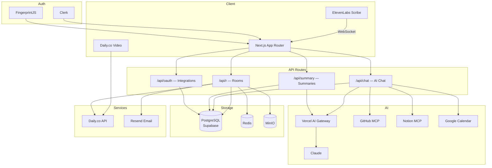

<h3 align="center">
  <br/>
  <span style="font-weight:600;font-size:20px;">meet.up</span>
  <br/>
  <br/>
  <a href="https://github.com/crafter-station/meet.up/stargazers" target="_blank">
    
  </a>
</h3>

<p align="center">
  Video calls with superpowers. Live transcription, AI-powered notes, and smart summaries — built for teams that ship.
</p>

## Features

- **Live transcription** — Every word, every speaker, captured in real time
- **AI summaries** — Decisions, action items, and key takeaways generated automatically
- **Zero friction** — No downloads, no plugins. Share a link and start in seconds
- **GitHub integration** — Create issues, look up repos, and reference code mid-call
- **Google Calendar** — Schedule meetings and sync your calendar in one click
- **Web search** — Find answers and references without leaving the conversation

## Tech Stack

- [Next.js 16](https://nextjs.org) + React 19
- [Daily](https://daily.co) for video/audio
- [Vercel AI SDK](https://sdk.vercel.ai) + [ElevenLabs](https://elevenlabs.io) for AI features
- [Clerk](https://clerk.com) for authentication
- [Drizzle ORM](https://orm.drizzle.team) + PostgreSQL
- [Tailwind CSS 4](https://tailwindcss.com)

## Architecture



## Get Started

1. Install dependencies:

```bash
bun install
```

2. Copy `.env.example` and fill in your keys:

```bash
cp .env.example .env
```

```
# Core
DATABASE_URL=
REDIS_URL=
NEXT_PUBLIC_APP_URL=http://localhost:3000

# Video & Transcription
DAILY_API_KEY=
ELEVENLABS_API_KEY=

# AI
AI_GATEWAY_API_KEY=
OPENAI_API_KEY=

# Auth
NEXT_PUBLIC_CLERK_PUBLISHABLE_KEY=
CLERK_SECRET_KEY=

# Storage
NEXT_PUBLIC_SUPABASE_URL=
NEXT_PUBLIC_SUPABASE_ANON_KEY=
MINIO_ENDPOINT=
MINIO_ACCESS_KEY=
MINIO_SECRET_KEY=
MINIO_BUCKET_NAME=

# Email
RESEND_API_KEY=

# Integrations (optional)
GOOGLE_CLIENT_ID=
GOOGLE_CLIENT_SECRET=
GITHUB_CLIENT_ID=
GITHUB_CLIENT_SECRET=
NOTION_CLIENT_ID=
NOTION_CLIENT_SECRET=
```

3. Run database migrations and start the dev server:

```bash
bun db:migrate
bun dev
```

## License

MIT
